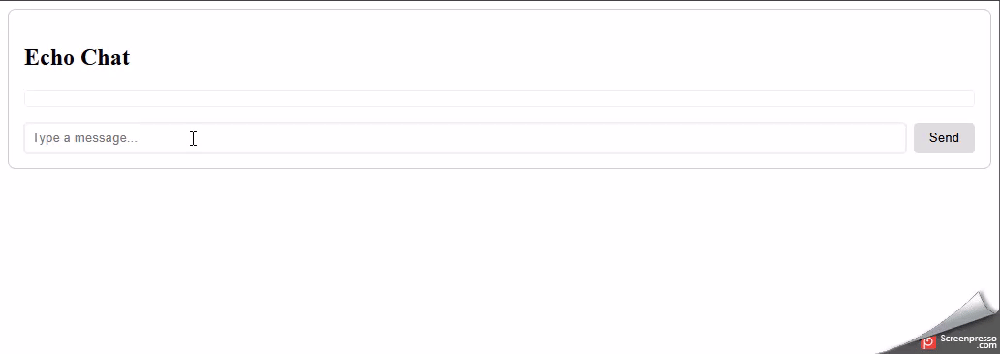

# 📖 Echo Chat Angular — Projeto PDI

**Descrição**  
Este projeto é um exemplo de aplicação Angular que demonstra o uso de WebSockets para comunicação em tempo real, desenvolvido como parte do meu Plano de Desenvolvimento Individual (PDI). O objetivo é aprimorar o domínio de conexões em tempo real, praticar o uso de RxJS no contexto Angular e implementar testes unitários robustos. Para facilitar o desenvolvimento e demonstração, o projeto utiliza o servidor Echo do Postman, que retorna instantaneamente todas as mensagens enviadas pelo usuário, permitindo validar rapidamente o fluxo de envio e recebimento de mensagens. A interface é simples, com campo de entrada de texto e lista dinâmica de mensagens, oferecendo um exemplo prático de comunicação reativa em Angular.

## 💡Funcionalidades

-   Envio de mensagens do usuário e recebimento instantâneo de respostas do servidor.
    
-   Serviço `WebsocketService` para gerenciar conexão, envio e recebimento.
    
-   Interface simples com campo de texto e lista dinâmica de mensagens.
    
-   Componentes standalone com suporte a `ngModel` via `FormsModule`.
    
-   Testes unitários completos com Jasmine/Karma usando mocks do WebSocket.

## 🤖Tecnologias

-   Angular 20
    
-   RxJS
    
-   TypeScript
    
-   SCSS
    
-   Jasmine / Karma (testes unitários)

## 🛠️Como rodar

1.  Clonar o repositório:
	```bash
	git clone https://github.com/SEU-USUARIO/echo-chat-angular.git
	cd echo-chat-angular
	```
2.  Instalar dependências:
	```bash
	npm install
	```

3.  Rodar a aplicação:
	```bash
	ng serve // ou npm run start
	```

4.  Acessar no navegador:
	```bash
	http://localhost:4200
	```

## 🧪 Testes

Para executar os testes unitários:

`ng test` 

Todos os testes simulam mensagens do servidor sem precisar de conexão real.

## 🎬Demo

